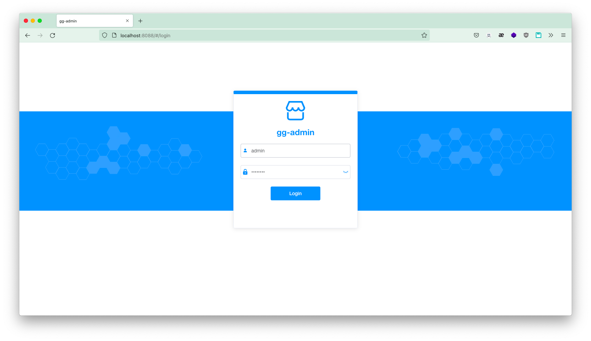
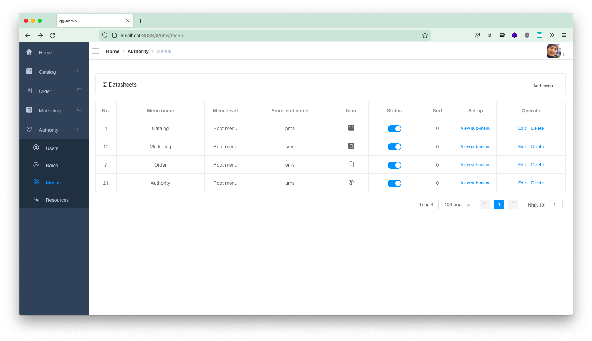

# gg-admin (đồ án đang trong quá trình hoàn thiện)
gg-admin | đồ án kết thúc khóa học Java Spring Boot
- Chạy ứng dụng, yêu cầu docker, docker-compose.
```shell script
git clone https://github.com/truongvantuan/gg-admin.git
```
- Tại thư mục gốc của project
```shell script
docker-compose up 
```
- Đăng nhập bằng tài khoản admin/admin123

- Thiết lập menu

